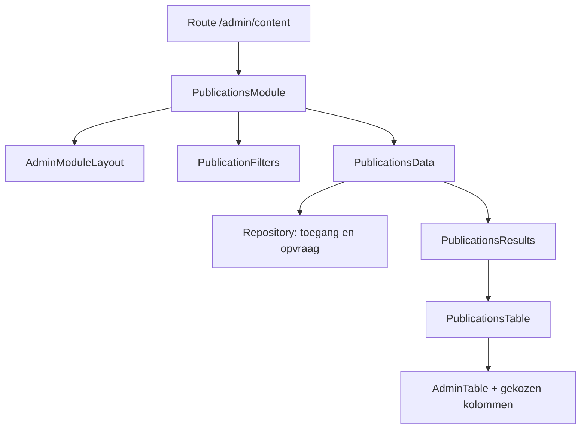

# Publicaties opbouwen met componenten

Begin in `src/components/admin/publications/PublicationsModule.tsx`. Dat is het samenstelbestand van het scherm: je kiest daar welke bouwstenen je gebruikt. De route `/admin/content` opent deze module. De huidige module gebruikt de [schrijfwerkplek met collecties, tabbladen en tekstsecties](admin-writing-workspace.md). Die handleiding beschrijft de actuele pagina en opslag.

Hieronder staat de eerdere opbouw met een tabel. Deze losse tabel-, filter- en gegevenscomponenten blijven beschikbaar voor hergebruik. Het codevoorbeeld toont hoe je die tabelweergave kunt samenstellen; de huidige Publicaties-pagina gebruikt `WritingWorkspaceData` op die plek.

We noemen het scherm een **module**. Het **datamodel** in `model.ts` beschrijft wat een publicatie is. Zo blijven de bouw van een scherm en de betekenis van de gegevens los van elkaar.

## Waar pas je wat aan?

| Wat wil je aanpassen? | Bestand |
| --- | --- |
| Het scherm samenstellen: titel, acties, filters en resultaten | `src/components/admin/publications/PublicationsModule.tsx` |
| De gedeelde indeling van modules | `src/components/admin/modules/AdminModuleLayout.tsx` |
| Gedeelde modulekleuren, filterbalk en tabelstijl | `src/components/admin/modules/modules.css` |
| De titel en omschrijving tonen | `src/components/admin/AdminPageHeading.tsx` |
| Welke filters Publicaties heeft | `src/components/admin/publications/PublicationFilters.tsx` |
| De gedeelde filterbalk en verzendknop | `src/components/admin/modules/AdminFilterBar.tsx` |
| Welke kolommen je ziet en in welke volgorde | `src/components/admin/publications/publication-columns.tsx` |
| De basis van alle tabellen | `src/components/admin/modules/AdminTable.tsx` |
| De tabel voor publicaties | `src/components/admin/publications/PublicationsTable.tsx` |
| Gegevens ophalen en doorgeven aan de gekozen weergave | `src/components/admin/publications/PublicationsData.tsx` |
| Database lezen met controle van beheertoegang | `src/lib/admin/publications/repository.ts` |
| De databasevelden, filters en sortering van de opvraag | `src/lib/admin/publications/query.ts` |
| Publicatie-eigenschappen en namen van types/statussen | `src/lib/admin/publications/model.ts` |
| Filterwaarden controleren en in een URL bewaren | `src/lib/admin/publications/filters.ts` |

## Hoe de onderdelen samenwerken



De module vult de plekken van de layout met React-componenten. `header`, `filters` en `notice` zijn benoemde plekken; `children` is de inhoud tussen de opening en sluiting van de layout. Dit is [compositie met props en children](https://react.dev/learn/passing-props-to-a-component).

De praktische kern van de bestaande module is:

```tsx
<AdminModuleLayout
  accent="#63469c"
  header={<AdminPageHeading title="Publicaties" description="Je publicaties."><PublicationActions /></AdminPageHeading>}
  filters={<PublicationFilters value={filters} action="/admin/content" />}
>
  <PublicationsData filters={filters}>
    {result => (
      <PublicationsResults
        result={result}
        filters={filters}
        columns={publicationColumns}
        basePath="/admin/content"
      />
    )}
  </PublicationsData>
</AdminModuleLayout>
```

Het werkelijke bestand heeft daarnaast een melding na verwijderen en een `Suspense`-grens met een laadmelding. Die staan los van de tabel. De functie `result => ...` bepaalt wat er met het opgehaalde resultaat wordt getoond. Beide componenten draaien op de server; deze functie wordt niet naar de browser gestuurd.

## Type, status en plaatsing

Een publicatie heeft drie afzonderlijke eigenschappen:

| Eigenschap | Betekenis | Veld in de database |
| --- | --- | --- |
| `type` | Artikel, analyse, casus of onderzoek | `content_type` |
| `status` | Concept, broncheck, gepubliceerd enzovoort | `status` |
| `placement.featured` en `placement.position` | Instelling voor uitlichten en positie | `featured`, `featured_position` |

Een analyse kan een concept zijn en alvast als hoofditem ingesteld staan. Het instellen van die plaatsing publiceert niets. Een filter op type verandert geen status; een filter op plaatsing filtert niet automatisch op gepubliceerd.

De datalaag kent geen adminroute of publieke URL. `toPublication` vertaalt databasevelden naar dit model. De tabel bepaalt welke gegevens je wilt tonen; de bestaande publieke routering bepaalt waar gepubliceerde content gelezen wordt.

De bestaande database heeft een vaste set toegestane types. Een nieuw type volledig invoeren vraagt daarom ook aandacht voor databasevalidatie, de editor en de publieke weergave. Alleen een extra label in `model.ts` maakt nog geen nieuw type in de hele toepassing.

Ledenpublicaties blijven een aparte gegevensbron met hun eigen toegangsregels. Ze zijn in deze stap niet samengevoegd met de openbare publicaties.

## Kleine aanpassingen om mee te beginnen

**Een kolom verplaatsen:** verplaats het bijbehorende object in `publication-columns.tsx`. De volgorde in de array is de volgorde op het scherm.

**Een kolom weglaten voor dit scherm:** geef in `PublicationsModule` bijvoorbeeld `columns={publicationColumns.filter(column => column.id !== "updated")}` door. Het veld blijft beschikbaar in de gegevens.

**Een extra bouwsteen invoegen:** importeer je eigen component in `PublicationsModule` en zet hem boven of onder `PublicationsData`. Aan de database hoeft daarvoor niets te veranderen.

**De vorm van alle modules veranderen:** pas de plekken in `AdminModuleLayout` en de bijbehorende regels in `modules.css` aan. Deze layout kent zelf geen publicaties. Een volgende module voor bijvoorbeeld gebruikers kan dezelfde layout, filterbalk en basistabel gebruiken.

**Alleen de kleur van dit scherm veranderen:** wijzig de `accent`-prop op `AdminModuleLayout`. De algemene typografie, tussenruimte en tabelstijl komen uit de gedeelde adminstijl.

## Waar React hier helpt

De filters gebruiken [Next.js Form](https://nextjs.org/docs/app/api-reference/components/form): navigeren binnen de app houdt de bestaande sidebar en gedeelde layout vast. Filters staan in de URL, zodat vernieuwen en teruggaan dezelfde selectie kunnen herstellen. De filters worden bij nieuwe URL-waarden opnieuw opgebouwd, zodat de velden bij die selectie passen.

De resultaten hebben een eigen laadstatus met `Suspense`; de bestaande `SubmitButton` gebruikt React `useFormStatus` voor feedback bij verzenden. De databaseopvraag blijft op de server en controleert steeds de bestaande redactierol. Er wordt geen tweede kopie van alle publicaties in browserstate bijgehouden.

We laden 25 resultaten per pagina, met een stabiele volgorde op wijzigingsdatum en ID. Volgende/vorige bewaren alle filters. Zo zijn ook meer dan de standaard API-limiet aan publicaties bereikbaar. Een databasefout krijgt een foutmelding; een lege selectie krijgt een lege-toestandmelding.

Deze eerste stap maakt het scherm in code samenstelbaar. Slepen van blokken en een visuele schermbouwer zijn nog geen onderdeel van deze wijziging.

## Controleren

```bash
node --test tests/publications-module.test.mjs
npm run test:workspace
npm run build
```

De tests controleren onafhankelijke filters, letterlijke zoektekens, paginering, toegangscontrole, foutafhandeling en het omwisselen van tabelkolommen. De netwerkverzoeken in deze tests gebruiken lokale testantwoorden; ze wijzigen geen echte publicaties.
